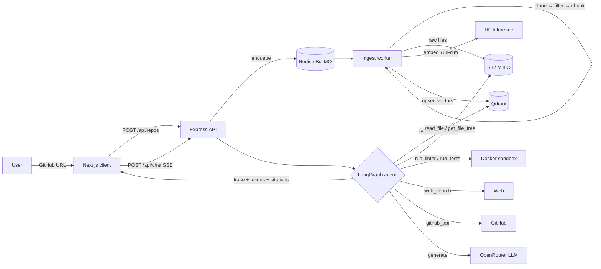

# RepoScribe — Agentic RAG Codebase Assistant

Submit a public GitHub repo URL; RepoScribe ingests and indexes the codebase, then a
**LangGraph agent** answers questions about it by *choosing* between tools — semantic
search, file reading, sandboxed code execution, GitHub actions, and web search — rather
than doing plain retrieve-and-answer. Every answer ships with a **live tool-use trace**
and **clickable code citations**.

> Full-stack TypeScript · Next.js + Node/Express · LangChain/LangGraph · Qdrant · BullMQ ·
> Docker sandbox · SSE streaming. Two fully-decoupled projects (`/client`, `/server`).

---

## 📊 By the numbers

Real, measured figures from this repo (not estimates):

| Metric | Value |
|---|---|
| **Automated tests** | **87 passing** (72 server + 15 client), external services fully mocked — zero network in CI |
| **Test coverage** | Server **75% lines / 73% statements**; client **67% lines** (focused on chunking, agent routing, API routes, sandbox) |
| **Codebase** | **~4,850 lines of TypeScript** — 2,455 server src / 1,086 server tests / 1,096 client src / 207 client tests |
| **Agent** | **7 tools**, **7-node** LangGraph state machine with conditional routing + a self-evaluating sufficiency check |
| **API surface** | **6 REST/SSE endpoints** across 41 server modules |
| **Retrieval quality** | On a labeled eval (real HF `bge-base` + Qdrant): **Recall@5 = 75%**, **Recall@8 = 88%**, **MRR = 0.54** |
| **Retrieval latency** | **~420 ms** avg semantic query (embedding + vector search), sub-second p50 |
| **Ingestion** | Async BullMQ pipeline, **768-dim** embeddings, concurrent S3 uploads (10-way); e.g. an 11-file repo → **63 chunks** end-to-end |
| **Sandbox isolation** | Untrusted code runs with `--network none --read-only --cap-drop ALL`, 256 MB / 1 CPU / 15 s hard limits |
| **Verified end-to-end** | Against **real** HF Inference, Qdrant, OpenRouter, S3 (MinIO), and Docker — not just mocks |

Reproduce these: `npm run test:coverage` (both projects), `npx tsx scripts/eval-retrieval.ts`
(retrieval), `npx tsx scripts/verify-slice.ts` (full agent E2E), `GET /api/metrics` (live latencies).

---

## Architecture



### The agent graph (`server/src/services/agent/graph.ts`)

```
router ─┬─ search   → retrieve → sufficiency ─┬─ sufficient → generate
        │                                     └─ insufficient → expand → generate
        ├─ structure → get_file_tree → generate
        ├─ action    → github_api_create_issue → generate
        ├─ external  → web_search → generate
        └─ execute   → run_linter / run_tests (sandbox) → generate
```

The **router** classifies intent, **sufficiency check** decides whether retrieval was
enough or the agent must **expand** (read a full file / search the web) — this
self-correction is the core "agentic" behavior, visible in the UI trace panel.

---

## Tech stack

- **Frontend:** Next.js (App Router) + TypeScript + Tailwind; SSE streaming via `fetch` + `ReadableStream`; react-markdown + highlight.js
- **Backend:** Node + Express + TypeScript
- **Agent:** LangChain + LangGraph, Zod-typed tools
- **Vector DB:** Qdrant (single collection, `repoId`-filtered)
- **Embeddings:** Hugging Face Inference API (`BAAI/bge-base-en-v1.5`, 768-dim)
- **LLM:** OpenRouter (OpenAI-compatible; default `openai/gpt-oss-120b:free`, hot-swappable via `LLM_MODEL`)
- **Queue:** BullMQ + Redis · **Storage:** AWS S3 (MinIO in dev) · **Sandbox:** Docker
- **Tests:** Jest + React Testing Library

---

## Quick start (local)

```bash
# 1. Infra: Redis + Qdrant + MinIO (auto-creates the bucket)
docker compose up -d

# 2. Server — copy env, add your keys (OpenRouter + HF)
cd server && cp .env.example .env
#   Local MinIO S3 config is already in .env.example.
npm install
npm run dev            # API on :5000
npm run worker         # ingestion worker (separate terminal — required)

# 3. Client
cd client && npm install && npm run dev   # :3000
```

Open **http://localhost:3000**, paste a small repo (e.g. `https://github.com/sindresorhus/p-limit`),
watch it ingest, then chat. Required keys: `OPENROUTER_API_KEY`, `HF_API_KEY` in `server/.env`.

---

## API

| Endpoint | Purpose |
|---|---|
| `POST /api/repos` | Validate + GitHub preflight (rejects invalid/private/oversized) → enqueue job → `{jobId}` |
| `GET /api/repos/:jobId/status` | Poll ingestion progress (`cloning → uploading → chunking → embedding → done`) |
| `GET /api/repos/:repoId` | Repo metadata (file/chunk counts, indexed-at, file list) |
| `POST /api/chat` | **SSE stream**: `trace` · `citations` · `token` · `done` / `error` |
| `GET /api/repos/:repoId/raw/*` | Raw file contents (proxied via API — no browser→S3 CORS) |
| `GET /api/repos/:repoId/files/*` | Presigned S3 URL for raw file download |
| `GET /api/metrics` | Live counters + latency histograms (p50/p95/p99) |

**Auth (optional, multi-user):** set Clerk keys (`CLERK_SECRET_KEY` + `NEXT_PUBLIC_CLERK_PUBLISHABLE_KEY`)
to require sign-in and scope repos to their owner (`ownerUserId` in the manifest, enforced on
every repo route). Leave them blank to run as a single anonymous user — the app and tests work either way.

---

## Testing

```bash
cd server && npm run test:coverage    # 66 tests
cd client && npm run test:coverage    # 15 tests
```

All external services (Qdrant, S3, HF, OpenRouter, GitHub, Docker) are mocked — the suite
never touches the network. Priority coverage: chunking boundaries + line-number math,
file filtering, agent router tool selection, sufficiency → expansion, full-graph tool-call
sequences, sandbox hardening, and API error handling.

---

## Engineering notes (gotchas solved)

- **HF Inference endpoint moved.** The legacy `api-inference.huggingface.co` is dead; embeddings use the `router.huggingface.co/hf-inference/...` path. `jina-embeddings-v2-base-code` isn't served there → default is `bge-base-en-v1.5` (768-dim).
- **OpenRouter free models rate-limit.** Qwen free slugs 429'd; default is `openai/gpt-oss-120b:free`. Any tool-calling model works via `LLM_MODEL`.
- **BullMQ bundles its own `ioredis`.** Pass plain connection *options*, not an `ioredis` instance, to avoid a cross-copy type conflict.
- **LangChain + Zod + LangGraph TS2589** ("excessively deep") — contained with a localized `any` on the `tool()`/`StateGraph` builder and a narrow `ChatInvoker` interface.
- **ESLint ESM flat config ignores `NODE_PATH`** — the sandbox image installs linters *locally* in `/sandbox` so the config resolves them offline.

---

## Deployment

- **Client → Vercel** (set `NEXT_PUBLIC_API_URL`).
- **Server + worker → Railway / Render / EC2** (run `npm run worker` as a separate process/service).
- **Qdrant → Qdrant Cloud** (set `QDRANT_URL` + `QDRANT_API_KEY`); **Redis → managed Redis**; **S3 → AWS** (unset `S3_ENDPOINT`).
- **Data retention:** `npm run s3:lifecycle` sets a rule to auto-expire `repos/*` after N days (`LIFECYCLE_DAYS`).

---

## Project layout

```
/client   Next.js app         — intake · streaming chat · tool-trace · citations · file viewer
/server   Express API + worker — ingest · embeddings · Qdrant · LangGraph agent · Docker sandbox
docker-compose.yml            — Redis + Qdrant + MinIO for local dev
```

Each project is independently runnable/deployable with its own `package.json`, `.env`,
tests, and `CLAUDE.md`. Types are intentionally duplicated (not shared) for full decoupling.

> Educational / portfolio project demonstrating agentic RAG, tool orchestration, streaming, and safe code execution.
