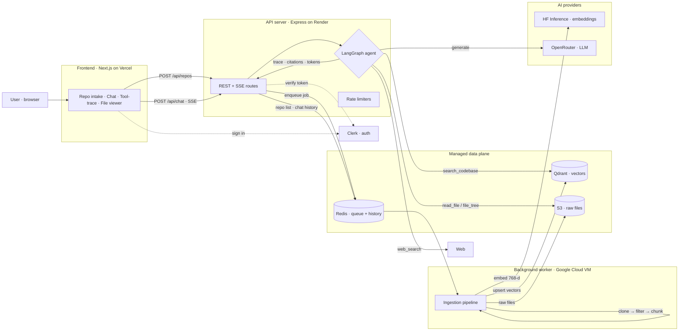
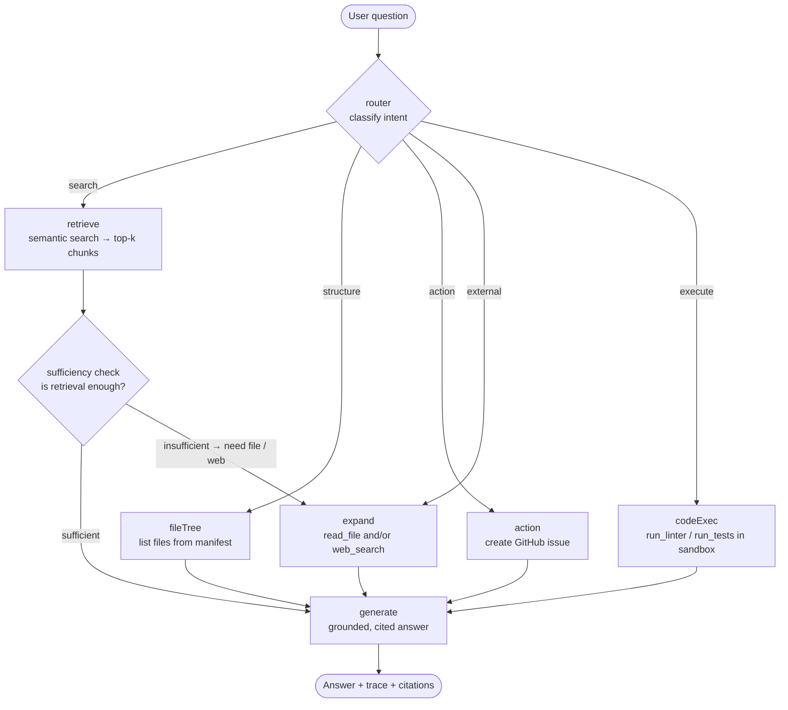
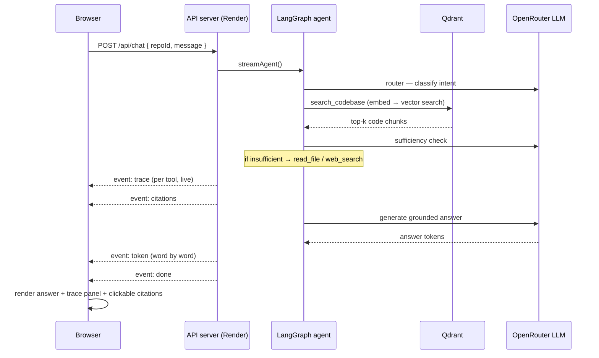
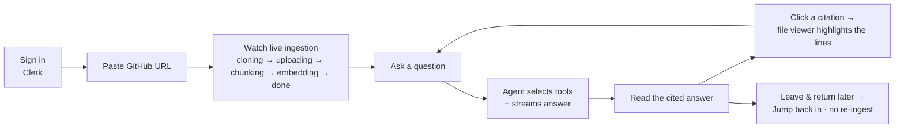
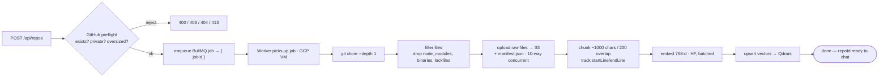
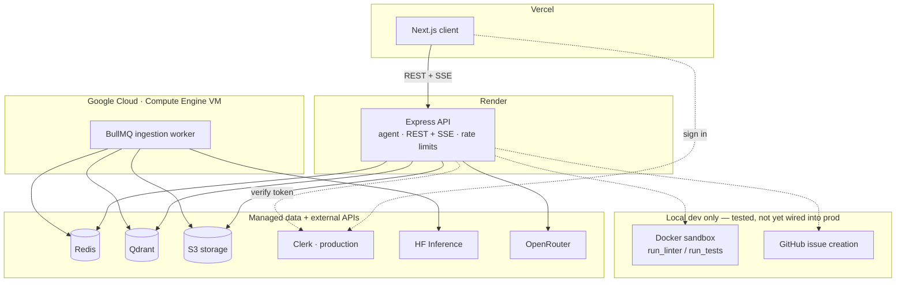

# RepoScribe

### An Agentic RAG Codebase Assistant — chat with any GitHub repo, and watch the agent think

> Paste a public GitHub URL. RepoScribe ingests and indexes the codebase, then a **LangGraph
> agent** answers questions about it by *choosing* between tools — semantic search, file reading,
> sandboxed code execution, GitHub actions, and web search — instead of doing plain
> retrieve-and-answer. Every answer ships with a **live tool-use trace** and **clickable code
> citations** (`path/to/file.ts:10-30`).

> **Full-stack TypeScript** · Next.js + Node/Express · LangChain/LangGraph · Qdrant · Hugging Face ·
> OpenRouter · BullMQ · Docker sandbox · SSE streaming · Clerk auth · **129 automated tests**.
> Two fully-decoupled projects (`/client`, `/server`) deployed across **Vercel, Render, and a
> Google Cloud VM**.

---

## Introduction / Overview

**RepoScribe** is a *"chat with your codebase"* application. Instead of answering from general
knowledge like a normal chatbot, it answers from **one specific repository's actual code** — and
it proves every claim by citing the exact files and line ranges it used.

The buzzword is **"Agentic RAG Codebase Assistant,"** and both halves are load-bearing:

- **RAG (Retrieval-Augmented Generation)** — before the LLM answers, the app *retrieves* the
  relevant code chunks by **meaning** (not keywords) and grounds the answer in them. Ask "how does
  it limit concurrency?" and it finds `activeCount < concurrency` even though the code never says
  the word "limit."
- **Agentic** — the assistant doesn't run one fixed "search → answer" step. A **router** classifies
  intent, a **sufficiency check** decides whether retrieval was actually enough, and the agent can
  **self-correct** by reading a whole file or searching the web before it answers. It picks from
  **7 tools** dynamically. This decision-making is rendered live in the UI as a **tool-use trace**
  — visible proof it's an agent, not a wrapped prompt.

Unlike a single-service demo, RepoScribe is a genuine **multi-service system**: a decoupled
frontend and backend, an asynchronous ingestion worker, a vector database, object storage, a job
queue, a sandboxed code executor, and pluggable AI providers — each independently deployable.

It was built **solo** as a deep-dive portfolio project to learn agent orchestration, retrieval
systems, streaming, safe code execution, and multi-server deployment end to end.

---

## Goals of the Project

Main objectives:

* Build a **real agent**, not a chatbot — dynamic tool selection + a self-evaluating retrieval loop
* Implement **semantic retrieval (RAG)** over arbitrary codebases with accurate line-level citations
* Master **LangGraph** as a state machine: nodes, conditional edges, and streamed node-level events
* Run **untrusted code safely** in a hardened Docker sandbox (no network, locked-down capabilities)
* Design an **asynchronous ingestion pipeline** (queue + worker) that never blocks the API thread
* Stream answers **token-by-token over SSE**, with the tool trace filling in live
* Ship **production concerns**: auth, per-user rate limiting, persistence, metrics, and 100+ tests
* Deploy a **scalable, multi-host architecture** (Vercel + Render + Google Cloud VM + managed data)

---

## Architecture Overview

RepoScribe separates concerns across five layers, each independently runnable and deployable.

### Frontend

* Built with **Next.js (App Router) + React 19 + TypeScript + Tailwind CSS**
* Streams chat responses via **`fetch` + `ReadableStream`** (browser `EventSource` can't POST an SSE body)
* Renders Markdown answers with syntax highlighting (`react-markdown` + `rehype-highlight`)
* First-class **tool-trace panel** and **clickable citation chips** → a file viewer that highlights cited lines
* **localStorage** caches recent repos + chat history (per user) for instant reloads

### Backend API

* **Node.js + Express + TypeScript**, organized as thin `routes/` delegating to `services/`
* Exposes **REST + SSE**; `app.ts` (app factory, testable via supertest) is split from `index.ts` (owns `listen`)
* Hosts the **LangGraph agent**, per-user **rate limiting**, optional **Clerk auth**, and **live metrics**

### Background Worker

* A **separate BullMQ process** that owns the heavy ingestion pipeline (clone → filter → chunk → embed → index)
* Runs **independently of the API** so a slow ingest never blocks a request; communicates only via Redis

### AI / Agent Layer

* **LangChain + LangGraph** orchestration, with strictly **Zod-typed tools**
* **Hugging Face Inference API** for embeddings (`BAAI/bge-base-en-v1.5`, 768-dim)
* **OpenRouter** (OpenAI-compatible) for the LLM — **model-agnostic and hot-swappable** via `LLM_MODEL`

### Data Layer

| Store | Role |
| --- | --- |
| **Qdrant** | Vector database — embedded code chunks, one collection, always `repoId`-filtered |
| **AWS S3 / MinIO** | Raw source files (`repos/{repoId}/raw/...`) + a `manifest.json` table of contents |
| **Redis** | BullMQ job queue **and** per-user persistence (repo list + chat history) |

> There is **no SQL database**. The S3 manifest answers "what files exist," and Qdrant is the
> search index — a deliberately lean data plane.

---

## System Architecture



---

## The Agentic RAG / LangGraph Flow

This is the heart of RepoScribe. The agent is a **LangGraph `StateGraph`** (`server/src/services/agent/graph.ts`)
— an **8-node** state machine with conditional routing and a self-correcting retrieval loop.



**How it works (each node reads shared state and returns updates):**

1. **router** — the LLM classifies the question into one of **5 intents** (`search`, `structure`,
   `action`, `external`, `execute`) and returns JSON. This picks the first branch.
2. **retrieve** — embeds the question and runs a `repoId`-filtered vector search in Qdrant → top-k chunks.
3. **sufficiency check** — *the core agentic step.* The LLM judges "do these chunks actually answer
   the question?" If **yes** → generate. If **no**, it names a specific file to read or a web query,
   and routes to **expand**. The app reasons about its **own retrieval quality**.
4. **expand** — reads a full file from S3 and/or performs a web search to fill the gap.
5. **fileTree** — lists the repo's files (from the manifest) for structural questions.
6. **action** — creates a GitHub issue when the user explicitly asks *(local-only for now — see below)*.
7. **codeExec** — runs a linter or tests inside the Docker sandbox *(local-only for now — see below)*.
8. **generate** — builds the final prompt from all gathered context and writes the grounded, cited answer.

Every node records a **trace entry** (tool name, input, output, latency, ok/fail) — that trace is
exactly what the UI's collapsible "Agent trace" panel renders.

### A chat turn, end to end (streamed over SSE)



The endpoint streams five SSE event types — `trace`, `citations`, `token`, `done`, and `error` —
built on LangGraph's `.stream({ streamMode: 'updates' })`, so the trace panel and answer fill in
**as the agent works**, not after it finishes.

---

## Key Features

### Ingestion & Retrieval
* Submit any **public GitHub repo**; validated + preflighted before a job is ever enqueued
* **Language-aware chunking** (~1000 chars, 200 overlap) with exact `startLine`/`endLine` tracking → precise citations
* **768-dim semantic embeddings** (Hugging Face), batched for throughput
* **`repoId`-scoped vector search** — never leaks across repositories

### Agentic Chat
* **Dynamic tool selection** across 7 Zod-typed tools via a router LLM
* **Self-correcting sufficiency loop** — expands retrieval only when needed
* **Live tool-use trace** with per-tool latency and success/failure
* **Token-by-token streaming** answers over SSE

### Citations & File Viewer
* Every answer carries **`file:line-line` citation chips**
* Clicking a chip opens a **file viewer** that scrolls to and **highlights the cited range**
* Raw files are proxied through the API (no browser → S3 CORS headaches)

### Persistence & Multi-User
* **Clerk authentication** (production instance) — scopes every repo/chat to its owner
* **"Jump back in"** — reopen any previously-indexed repo in one click, **no re-ingestion**
* **Resume conversations** across devices (Redis is source of truth when signed in; localStorage caches)

### Safety & Operations
* **Hardened Docker sandbox** for untrusted code *(local-only for now — see Deployment)*
* **GitHub issue creation** from chat *(local-only for now — see Deployment)*
* **Per-user rate limiting** on the expensive endpoints
* **Live metrics** (`GET /api/metrics`) — counters + p50/p95/p99 latency histograms

---

## Tech Stack

### Frontend
* **Next.js 15 (App Router)**, **React 19**, **TypeScript**, **Tailwind CSS**
* SSE via `fetch` + `ReadableStream`; `react-markdown` + `remark-gfm` + `rehype-highlight`
* `@clerk/nextjs` for auth; localStorage for per-user caching

### Backend
* **Node.js**, **Express**, **TypeScript**
* `@clerk/express` (auth), `express-rate-limit` (throttling), `cors`, `zod` (runtime validation)
* Custom in-process **metrics** service (counters + latency percentiles)

### AI & Agent
* **LangChain** + **LangGraph** (`@langchain/langgraph`, `@langchain/openai`, `@langchain/textsplitters`)
* **Embeddings:** Hugging Face Inference API — `BAAI/bge-base-en-v1.5` (768-dim)
* **LLM:** OpenRouter (OpenAI-compatible) — **hot-swappable** via `LLM_MODEL` (any tool-calling model)

### Data & Infrastructure
* **Qdrant** (vector DB) · **AWS S3 / MinIO** (object storage) · **Redis** (queue + persistence)
* **BullMQ** (async job queue) · **Docker** (local infra via `docker compose` + the code sandbox)

### Testing
* **Jest** (both projects) + **React Testing Library** + **supertest**
* Every external service (Qdrant, S3, HF, OpenRouter, GitHub, Docker) is **mocked** — zero network in CI

### Deployment
* **Frontend → Vercel**
* **API server → Render**
* **Background worker → Google Cloud (Compute Engine VM)**
* **Auth → Clerk (Production Instance)**
* **Managed data → Redis, Qdrant, S3-compatible storage**

---

## User Journey and Flow

### End-user flow



### Ingestion pipeline (asynchronous, in the worker)



The client polls `GET /api/repos/:jobId/status` and shows distinct states —
`cloning → uploading (n/total) → chunking → embedding → done` — rather than a generic spinner.

---

## Deployment Architecture

RepoScribe is a multi-service system, so "deploying" means hosting each piece and pointing them at
each other. The production topology:



| Component | Host | Notes |
| --- | --- | --- |
| Client (Next.js) | **Vercel** | Set `NEXT_PUBLIC_API_URL` + Clerk publishable key |
| API server (Express) | **Render** | Runs the agent; `CLIENT_ORIGIN` for CORS; `trust proxy` for real client IPs |
| Ingestion worker (BullMQ) | **Google Cloud VM** | A separate long-running process — `npm run start:worker` |
| Auth | **Clerk (Production Instance)** | Enforces per-user repo ownership on every route |
| Redis / Qdrant / S3 | **Managed services** | Shared by the API and the worker |

### Why the worker runs on a Google Cloud VM

The API server (Render) and the ingestion worker are **separate processes** that share Redis. The
worker does the memory-heavy lifting — cloning, chunking, and embedding whole repositories — so it
lives on its **own Google Cloud VM**, decoupled from the request-serving API. If ingestion is slow
or spikes, the API stays responsive.

### Two features that are local-only (for now)

Both of these are **fully implemented, tested, and working locally** — they're simply not enabled
in the current production deployment yet:

* **Docker code sandbox** (`run_linter` / `run_tests`) — needs a **Docker daemon on the host**.
  Render's web service can't run Docker-in-Docker, so the sandbox runs **locally only** for now. The
  other 6 tools work fine in production without it. It's covered by unit tests and verified against a
  real container (`scripts/verify-sandbox.ts`).
* **GitHub issue creation / issues integration** — requires a `GITHUB_TOKEN`, which isn't wired into
  the production instance yet, so it's exercised **locally only** for now. The tool, schema, and
  graph node are all implemented and unit-tested.

> Design-wise both are honest, guarded extensions: the sandbox node is gated behind Docker
> availability, and the GitHub tool throws a clear error when no token is configured — neither
> breaks the deployed app; they're just dormant until their host requirement is provisioned.

---

## Engineering Depth (the "additional stuff")

### Automated testing — 129 tests, zero network

| Suite | Tests | Focus |
| --- | --- | --- |
| **Server** | **94** | chunking + line-number math, file filtering, agent routing/tool-call sequences, sufficiency → expansion, sandbox hardening flags, API status codes, rate limiting, Redis persistence store |
| **Client** | **35** | chat input behavior, message + citation rendering, ingestion-progress states, recent-repos + chat-history caches |

Every external service (Qdrant, S3, Hugging Face, OpenRouter, GitHub, Docker) is **mocked**, so the
suite is fast, deterministic, and **never touches the network** — safe for CI. Beyond unit tests,
`server/scripts/` holds **verify scripts** that exercise the *real* services for manual proof:
`verify-slice.ts` (full agent E2E), `verify-sandbox.ts`, `verify-s3.ts`, and `eval-retrieval.ts`
(measures **Recall@k / MRR** on a labeled set).

```bash
cd server && npm run test:coverage    # 94 tests
cd client && npm run test:coverage    # 35 tests
```

### Rate limiting (`express-rate-limit`)

On by default (auto-disabled under tests). Three limiters, all **keyed per signed-in user** (falling
back to client IP when auth is off), every cap env-tunable:

| Limiter | Endpoint | Default |
| --- | --- | --- |
| `ingestLimiter` | `POST /api/repos` | **10 / min** — heavy: clone + embed |
| `chatLimiter` | `POST /api/chat` | **20 / min** — each message = several LLM calls |
| `globalLimiter` | `/api/*` | **100 / min** — broad safety net (`/api/health` exempt) |

The app sets `trust proxy` to a **number** (not `true`) so limits key off the real client IP behind
Render/Vercel's proxy — `express-rate-limit` v7 actually rejects `true` as IP-spoofable. Blocked
requests get **HTTP 429** with a JSON body and `RateLimit-*` headers.

### The hardened sandbox

When the agent runs a linter/tests, it executes **someone else's untrusted code**, so it runs in a
locked-down container:

```
--network none  --read-only  --cap-drop ALL  --security-opt no-new-privileges
--memory 256m  --cpus 1  --pids-limit 256   ·   15s hard timeout  ·  runs as USER node
```

Files are pulled from S3 into a temp dir, **bind-mounted read-only**, run, captured, and cleaned up.
The image bakes ESLint in **locally** so it resolves offline (ESM flat config ignores `NODE_PATH`).

### Live metrics

A tiny in-process tracker (counters + latency histograms with p50/p95/p99) is instrumented across
the agent, embedder, Qdrant search, and worker, exposed at `GET /api/metrics`.

---

## API Surface

| Endpoint | Purpose |
| --- | --- |
| `POST /api/repos` | Validate + GitHub preflight (reject invalid/private/oversized) → enqueue job → `{ jobId }` |
| `GET /api/repos` | List the signed-in user's previously-indexed repos (newest first) |
| `GET /api/repos/:jobId/status` | Poll ingestion progress (`cloning → uploading → chunking → embedding → done`) |
| `GET /api/repos/:repoId` | Repo metadata (file/chunk counts, indexed-at, file list) |
| `DELETE /api/repos/:repoId/registry` | "Forget" a repo from the recent list (keeps indexed data) |
| `POST /api/chat` | **SSE stream:** `trace` · `citations` · `token` · `done` / `error` |
| `GET` / `DELETE /api/chat/:repoId/history` | Load / clear a repo's saved conversation |
| `GET /api/repos/:repoId/raw/*` | Raw file contents (proxied via API — no browser→S3 CORS) |
| `GET /api/repos/:repoId/files/*` | Presigned S3 URL for raw file download |
| `GET /api/metrics` | Live counters + latency histograms (p50/p95/p99) |
| `GET /api/health` | Liveness probe (mounted before the rate limiter) |

---

## Challenges and Solutions

### Retrieval that understands *meaning*, not keywords
**Challenge:** "How does it limit concurrency?" must find code that never says "limit."
**Solution:** Semantic embeddings (`bge-base-en-v1.5`, 768-dim) + Qdrant vector search, `repoId`-scoped, with a self-evaluating **sufficiency check** that expands retrieval when the top-k isn't enough.

### Making the agent *provably* agentic
**Challenge:** Prove the assistant is more than a wrapped LLM call.
**Solution:** A LangGraph state machine with a router + conditional edges, and a **live tool-use trace** streamed to the UI — every tool call, input, latency, and outcome is visible.

### Running untrusted code without getting burned
**Challenge:** Linting/testing arbitrary repos means executing hostile code.
**Solution:** A Docker sandbox with **no network, read-only FS, dropped capabilities, resource caps, and a hard timeout**, running as an unprivileged user — plus offline-baked linters.

### Streaming a multi-step agent to the browser
**Challenge:** Show the trace and answer *as they happen*, and the browser can't POST an `EventSource`.
**Solution:** LangGraph `streamMode: 'updates'` → SSE frames, parsed on the client via `fetch` + `ReadableStream`.

### Not stranding the user on reload
**Challenge:** A random `repoId` lived only in page memory — a refresh or misclick forced a full re-ingest.
**Solution:** A persistence layer — Redis (source of truth when signed in) fronted by a localStorage cache — powers "Jump back in" and conversation resume across devices.

### Integration gotchas (solved, so you don't re-discover them)
* **HF moved their endpoint** — the legacy `api-inference.huggingface.co` is dead; embeddings use the `router.huggingface.co/hf-inference/...` path.
* **OpenRouter free models rate-limit** — so the LLM is **hot-swappable** via `LLM_MODEL`; any tool-calling model works.
* **BullMQ bundles its own `ioredis`** — pass plain connection *options* (and reuse the queue's client for persistence) to dodge a cross-copy type conflict.
* **LangChain + Zod + LangGraph TS2589** ("excessively deep") — contained with a localized `any` on the builder and a narrow `ChatInvoker` interface.

---

## Project Layout

```
/client   Next.js app         — intake · streaming chat · tool-trace · citations · file viewer
/server   Express API + worker — ingest · embeddings · Qdrant · LangGraph agent · Docker sandbox
docker-compose.yml            — Redis + Qdrant + MinIO for local dev
PROJECT_GUIDE.md              — a full, plain-English deep dive into every part of the system
```

Each project is independently runnable/deployable with its own `package.json`, `.env`, tests, and
`CLAUDE.md`. Types are intentionally **duplicated** (not shared) for full decoupling.

---

## Running It Locally

```bash
# 1. Infra: Redis + Qdrant + MinIO (auto-creates the bucket)
docker compose up -d

# 2. Server — copy env, add your keys (OpenRouter + Hugging Face)
cd server && cp .env.example .env
npm install
npm run dev            # API on :5000
npm run worker         # ingestion worker (separate terminal — REQUIRED)

# 3. Client
cd client && cp .env.example .env.local
npm install && npm run dev   # :3000
```

Open **http://localhost:3000**, paste a small repo (e.g. `https://github.com/sindresorhus/p-limit`),
watch it ingest, then chat. Required keys: `OPENROUTER_API_KEY` and `HF_API_KEY` in `server/.env`.
Leave the Clerk keys blank to run as a single anonymous user, or set them to enable multi-user auth.

> The **worker is a separate process** — without `npm run worker`, jobs are queued but never processed.

---

## Best Practices

* **Async by default** — ingestion always goes through the BullMQ queue; the API never clones/embeds inline
* **Strictly-typed tools** — every agent tool has a Zod schema; retrieval is always `repoId`-scoped
* **Safety is non-negotiable** — untrusted code only ever runs inside the hardened sandbox
* **Decoupled services** — client ⇄ server talk only over REST + SSE; no shared code
* **Fail loudly** — backend errors (bad URL, private/oversized repo, LLM timeout) surface in the UI
* **Everything mocked in tests** — deterministic, network-free CI
* **Secrets only in env vars** — `.env` is gitignored; only `.env.example` is tracked

---

## Conclusion

RepoScribe was more than a build — it was a deep dive into what makes software "agentic." From a
self-correcting LangGraph retrieval loop and a hardened code sandbox to token-streaming SSE, per-user
rate limiting, and a three-host deployment, I learned how to **architect, secure, and scale a real
multi-service AI application** — not just call an LLM.

> "The real product of building software isn't just the app — it's the engineer you become by building it."

---

## Author

**Muhammad Ali Khan**
Full-Stack Developer | AI-Native Apps | Agentic RAG | Real-Time Systems | Scalable Web Apps

* LinkedIn: [linkedin.com/in/m-alikhan0616](https://www.linkedin.com/in/m-alikhan0616/)
* GitHub: [github.com/alikhan0616](https://github.com/alikhan0616)
* Email: [m.akhan0616@gmail.com](mailto:m.akhan0616@gmail.com)

---

## License

Released under the **MIT License** — free to study, fork, and build on.

> Educational / portfolio project demonstrating agentic RAG, tool orchestration, streaming, safe
> code execution, and multi-service deployment.
